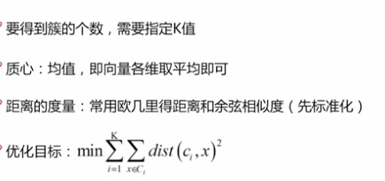
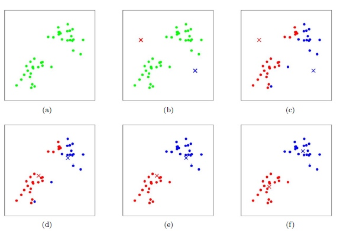

### K-Means算法
对于给定的样本集，按照样本之间的距离大小，将样本集划分为K个簇。让簇内的点尽量紧密的连在一起，而让簇间的距离尽量的大。
基本概念：

　　　　K-Means采用的启发式方式很简单，用下面一组图就可以形象的描述。

　　　　上图a表达了初始的数据集，假设k=2。在图b中，我们随机选择了两个k类所对应的类别质心，即图中的红色质心和蓝色质心，然后分别求样本中所有点到这两个质心的距离，并标记每个样本的类别为和该样本距离最小的质心的类别，如图c所示，经过计算样本和红色质心和蓝色质心的距离，我们得到了所有样本点的第一轮迭代后的类别。此时我们对我们当前标记为红色和蓝色的点分别求其新的质心，如图4所示，新的红色质心和蓝色质心的位置已经发生了变动。图e和图f重复了我们在图c和图d的过程，即将所有点的类别标记为距离最近的质心的类别并求新的质心。最终我们得到的两个类别如图f。

　　　　当然在实际K-Mean算法中，我们一般会多次运行图c和图d，才能达到最终的比较优的类别。